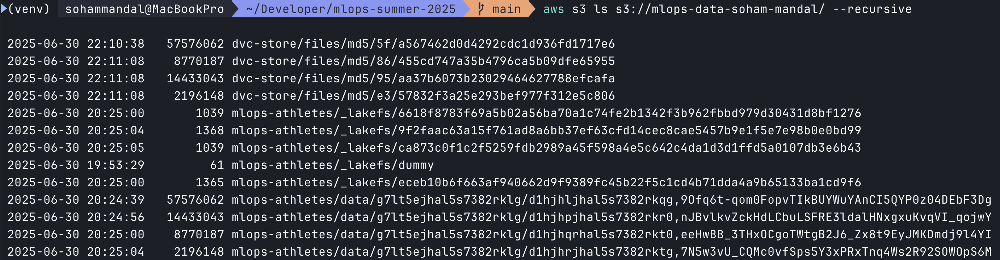

# MLOps Assignment – Data Versioning & Differential Privacy

This project implements data versioning and model training using **two tools**:

- [`lakeFS`](https://lakefs.io/) – for Git-like versioning of data in S3
- [`DVC`](https://dvc.org/) – for lightweight CLI-based versioning with S3 backend

The objective is to compare the two approaches while building and evaluating ML models with and without differential privacy.

---

## Folder Structure

```
mlops-summer-2025/
├── Data Versioning/
│   ├── .env                         # Env vars (AWS keys, LakeFS keys) - NOT committed
│   ├── athletes.csv                 # Original raw dataset - NOT committed
│   ├── v1_train.csv / v1_test.csv   # Dataset version 1 (raw + split) - NOT committed
│   ├── v2_train.csv / v2_test.csv   # Dataset version 2 (cleaned + split) - NOT committed
│   ├── docker_compose.yml           # Docker setup for LakeFS locally
│   ├── *.dvc                        # DVC pointers for v1/v2 CSVs
│   ├── data_cleaning.ipynb          # Dataset cleaning notebook
│   ├── eda_model_training.ipynb     # EDA + ML modeling notebook (baseline and v2)
│   ├── dp_training.ipynb            # Differential privacy modeling (TF Privacy)
│   ├── upload_versions_to_lakefs.sh # Shell commands
│   └── upload_versions_dvc.sh       # Shell commands
├── .dvc/                            # DVC config files
├── requirements.txt
└── README.md
```

---

## Cloud Storage

All datasets are versioned and stored in **Amazon S3**:
- LakeFS uses its own namespace and repo structure
- DVC stores versioned files under a clean prefix (`s3://mlops-data-soham-mandal/dvc-store/`)

Below is a snapshot of the `s3://mlops-data-soham-mandal/` bucket after pushing datasets with LakeFS and DVC:



---

## Approach Summary

- `v1`: Raw dataset from `athletes.csv` split into train/test
- `v2`: Cleaned and preprocessed dataset (outliers removed, survey answers filtered)
- All modeling (baseline, v2, and DP) done using the same codebase
- Data versioning is done separately using each tool (LakeFS and DVC)
- Results are compared using accuracy/metrics, and tool usability

---

## Final Deliverables

- Python notebooks/scripts for:
  - Data prep and versioning (v1 & v2)
  - Baseline model training (v1)
  - Updated model training (v2)
  - Differentially Private training (v2 + TensorFlow Privacy)
- Shell commands used for uploading CSVs to S3 using LakeFS and DVC
- One slide comparing **non-DP vs DP models**
- One slide comparing **LakeFS vs DVC** from a practical usage standpoint
