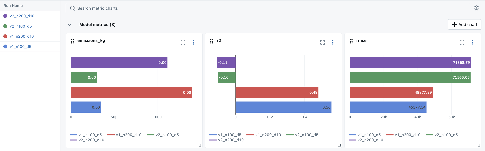

## Assignment 2: ML Experiments with Feature Store and Pipeline

### Objective
Build a machine learning pipeline using the `athletes.csv` dataset in Databricks, leveraging the Feature Store and running experiments with multiple feature versions and hyperparameters.

> **Disclaimer**: I used AI tools such as ChatGPT for guidance during this assignment, but all implementation and final work is my own.

---

### Tools & Platform
- **Platform**: Databricks
- **ML Pipeline**: scikit-learn
- **Feature Store**: Databricks Feature Store
- **Experiment Tracking**: MLflow
- **Carbon Tracking**: CodeCarbon

---

### Target & Problem
- **Target Variable**: `deadlift` — athlete's max deadlift weight
- **Task Type**: Regression

---

### Feature Versions

- **Version 1 (v1)**:
  - Raw features: `age`, `height`, `weight`, `candj`, `snatch`

- **Version 2 (v2)**:
  - Derived feature: `power_metric = candj + snatch`
  - Features: `age`, `height`, `weight`, `power_metric`

---

### Model & Experiments
- **Model Used**: `RandomForestRegressor` (no AutoML)
- **Hyperparameter Configs**:
  - `(n_estimators=100, max_depth=5)`
  - `(n_estimators=200, max_depth=10)`

- **Experiments Run**: 4 total
  - v1 with both configs
  - v2 with both configs

---

## Conclusion

Across four experiments using two feature versions and two hyperparameter settings, I observed clear differences in model performance:

- **Best performance** came from **`v1_n100_d5`**, achieving:
  - **Lowest RMSE**: 45,177
  - **Highest R²**: 0.56
  - **Lowest emissions**: 0.0000346 kg

- **`v1_n200_d10`** also performed reasonably well with a slightly higher RMSE and slightly lower R².

- **Both v2 runs underperformed**, with:
  - **High RMSE** (~71,000+)
  - **Negative R²**, indicating poor predictive value
  - Similar emissions, but worse accuracy

### Interpretation:
Feature Version 1 (raw features: `candj` and `snatch` separately) outperformed Feature Version 2 (which used a derived `power_metric`). Separating the two lift metrics seems to preserve more predictive signal than combining them.

All runs had **very low carbon emissions**, under 0.00015 kg CO₂, confirming the pipeline's efficiency on Databricks.

Final Recommendation: **Use v1 features with `n_estimators=100` and `max_depth=5` for the best balance of accuracy and efficiency.**
